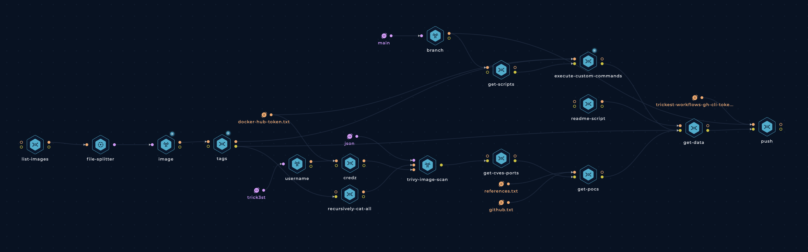

<h1 align="center">Containers </h1>
<h3 align="center">Automated privilege escalation of the world's most popular Docker images</h3>

This repository contains the results of a Trickest workflow that performs a collection of multiple types of security checks and vulnerability tests on DockerHub's top 100 most downloaded images. The tests include (but are not limited to):
- Checking for the usage of outdated software with known exploits
- Searching for developer tools installed 
- Getting the base OS
- `cat`ing the `/etc/passwd` and `/etc/shadow` in search for [blank passwords](https://www.securityweek.com/no-root-password-20-popular-docker-containers)
- Finding files owned by root user
- Searching for `guid` and `suid` executables
- Searching for hidden files, package names, world writable files and folders
- Enumerating password policies and SSL sertificates
- Enumeration of [GTFOBins](https://gtfobins.github.io/)
- Scanning for open ports
- [Add your own tests!](https://github.com/trickest/containers/issues/new)

## How it Works
A [Trickest](https://trickest.com) workflow collects a list of DockerHub's most used images and their tags. Then it uses a collection of [custom scripts](tests) and a couple of open-source tools like [trivy](https://github.com/aquasecurity/trivy) to get an overview of each image's security posture and overall attack surface.

### TB; DZ (Too big; didn't zoom)
- We start by enumerating a list of the most popular images from [DockerHub](https://docs.docker.com/docker-hub/api/latest) - this step can be modified to pull images from other (potentially private) image repositories as well.
- Once collected, Trickest's Docker-in-Docker integration is used to pull all tags of each image.
- Then a series of tests are run on each image:
    - [Trivy](https://github.com/aquasecurity/trivy) is used to find outdated software (thanks [aquasecurity](https://github.com/aquasecurity)!)
        - 💡 Tip: [CVEs](https://github.com/trickest/cve) repository is hyperlinked for CVEs that have POCs!
    - [A few shell scripts](tests) are also included to carry out other tests and collect other data (Contributions are welcome!)
- In the end, each test's results are written to a simple report and pushed to this repository.
- As with most of [our](https://github.com/trickest/cve) [previous](https://github.com/trickest/inventory) [projects](https://github.com/trickest/resolvers), this workflow is scheduled to run constantly and always have up-to-date results.

## Contribution
All contributions/ideas/suggestions are welcome! Feel free to create a new ticket via [GitHub issues](https://github.com/trickest/containers/issues), tweet at us [@trick3st](https://twitter.com/trick3st), or join the conversation on [Discord](https://discord.gg/7HZmFYTGcQ).

---
## ...Build your own workflows or run this one!
We believe in the value of tinkering. Sign up for an access or visit [trickest.com](https://trickest.com) to customize this workflow to your use case, get access to many more workflows, or build your own from scratch!

